# N8N Automations

[](https://opensource.org/licenses/MIT)


Repositori ini berisi platform otomatisasi alur kerja (workflow automation) berbasis **n8n** yang dikemas dalam satu aplikasi web. Platform ini menyediakan dua layanan berlangganan: **Financial Recording** dan **Social Media Intelligence**. Pengguna dapat memilih layanan, melakukan pembayaran melalui Midtrans, dan memicu alur kerja otomatis via n8n.

---

## 📋 Daftar Isi

- [Overview](#-overview)
- [Dampak & Pencapaian](#-dampak--pencapaian)
- [Apa yang Saya Pelajari](#-apa-yang-saya-pelajari)
- [Teknologi yang Digunakan](#-teknologi-yang-digunakan)
- [Struktur Project](#-struktur-project)
- [Database Schema](#-database-schema)
- [Instalasi](#-instalasi)
- [Penggunaan](#-penggunaan)
- [Kontribusi](#-kontribusi)
- [Lisensi](#-lisensi)

---

## 🎯 Overview

Platform ini adalah **sistem otomatisasi alur kerja** yang dibangun di atas **n8n** sebagai mesin orkestrasi, dengan antarmuka web modern menggunakan **Next.js**. Awalnya proyek ini dibangun sepenuhnya dengan **Laravel (PHP + Blade)**, namun kemudian **dimigrasi ke Next.js (TypeScript)** untuk meningkatkan performa, fleksibilitas, dan pengalaman pengembang.

### Layanan yang Tersedia:

1. **Financial Recording**  
   - Mengotomatisasi pencatatan transaksi keuangan dari berbagai sumber.  
   - Data diproses dan disimpan ke database.  
   - Notifikasi harian dikirim melalui **Telegram Bot** sebagai laporan ringkas.

2. **Social Media Intelligence**  
   - Mengumpulkan data publik dari profil media sosial (misal Instagram).  
   - Menganalisis konten, sentimen, engagement, dan topik.  
   - Menampilkan hasil analisis di dashboard web.  
   - Menyediakan laporan dalam bentuk **PDF** yang dapat diunduh.

### Alur Pengguna:
1. Pengguna memilih layanan (Financial atau Social Media).  
2. Melakukan pembayaran melalui **Midtrans**.  
3. Setelah pembayaran berhasil, sistem memicu alur kerja di **n8n** sesuai layanan.  
4. Hasil akhir (data keuangan atau analisis sosial media) disajikan di aplikasi web.

---

## 📈 Dampak & Pencapaian

- Mengembangkan **dua alur kerja otomatis** ujung‑ke‑ujung dalam satu platform berlangganan.
- Menerapkan alur pengguna terpadu: **pilih layanan → bayar → eksekusi workflow**.
- Mengintegrasikan **Midtrans** sebagai gateway pembayaran dan **n8n** sebagai mesin alur kerja.
- Membangun **workflow pencatatan keuangan** dengan logging otomatis ke database dan notifikasi Telegram harian.
- Membangun **workflow intelijen media sosial** yang mengumpulkan data publik, menganalisis, dan menghasilkan laporan PDF.
- Mengurangi proses operasional manual hingga sekitar **75%**.
- Meningkatkan kecepatan pelaporan, efisiensi operasional, dan aksesibilitas data.
---

## 🛠️ Teknologi yang Digunakan

| Teknologi | Deskripsi |
|-----------|-----------|
| **Next.js** (TypeScript) | Frontend & backend API (migrasi dari Laravel). |
| **n8n** | Platform orkestrasi alur kerja (self‑hosted). |
| **Midtrans API** | Gateway pembayaran untuk subscription. |
| **Telegram Bot API** | Notifikasi dan laporan harian. |
| **PostgreSQL** | Database utama. |
| **REST API** | Komunikasi antar service. |
| **Python** | Script tambahan untuk analisis data. |

> **Catatan Migrasi:** Proyek ini awalnya dibangun dengan Laravel (PHP + Blade), namun kemudian dimigrasi ke Next.js untuk meningkatkan performa, efisiensi pengembangan, dan kemudahan integrasi dengan ekosistem JavaScript/TypeScript. Kode Laravel lama masih tersedia sebagai arsip namun tidak lagi digunakan secara aktif.

---

## 📁 Struktur Project

```
n8n-automations/
├── automation_financial_recording/    # Workflow n8n untuk pencatatan keuangan
├── automation_social_media/          # Workflow n8n untuk analisis media sosial
├── nextjs-app/                       # Aplikasi Next.js (frontend + API)
│   ├── app/                          # App Router Next.js
│   ├── components/                   # Komponen React
│   ├── lib/                          # Utility & integrasi API
│   └── ...
├── legacy-laravel/                   # (Arsip) Kode Laravel lama
├── .vscode/                          # Konfigurasi VS Code
├── .gitignore
├── LICENSE
└── README.md                         # Dokumentasi ini
```

### Penjelasan Folder:

- **`automation_financial_recording/`** – Berisi definisi workflow n8n untuk layanan keuangan (JSON ekspor).  
- **`automation_social_media/`** – Workflow n8n untuk analisis media sosial.  
- **`nextjs-app/`** – Aplikasi web utama yang dibangun dengan Next.js (TypeScript).  
- **`legacy-laravel/`** – Kode Laravel versi awal (hanya untuk referensi).

---

## 📊 Database Schema

Sistem menggunakan **PostgreSQL** dengan skema yang mencakup modul **subscription/finansial** dan **analisis media sosial**. Diagram ERD berikut menggambarkan relasi antar tabel utama:

```mermaid
erDiagram
    users {
        bigint id PK
        text name
        text email
        text telegram_id
        text telegram_link_token
        timestamptz telegram_link_token_expires_at
        timestamptz email_verified_at
        text password
        text remember_token
        timestamptz created_at
        timestamptz updated_at
    }

    subscription_plans {
        bigint id PK
        text name
        integer price
        integer duration_days
        text product_type
        timestamptz created_at
        timestamptz updated_at
    }

    transactions {
        bigint id PK
        bigint user_id FK
        bigint plan_id FK
        text midtrans_order_id
        transaction_status status
        integer gross_amount
        text payment_type
        timestamptz settlement_time
        jsonb raw_response
        timestamptz created_at
        timestamptz updated_at
        text product_type
    }

    subscriptions {
        bigint id PK
        bigint user_id FK
        bigint plan_id FK
        bigint transaction_id FK
        subscription_status status
        timestamptz start_date
        timestamptz end_date
        timestamptz created_at
        timestamptz updated_at
    }

    medsos_packages {
        bigint id PK
        text code
        text name
        bigint financial_plan_id FK
        text description
        integer price
        integer quota_limit
        jsonb features
        boolean active
        text purchase_type
        timestamptz created_at
        timestamptz updated_at
    }

    medsos_entitlements {
        bigint id PK
        bigint user_id FK
        bigint transaction_id FK
        bigint package_id FK
        medsos_entitlement_status status
        integer quota_total
        integer quota_used
        timestamptz activated_at
        timestamptz expires_at
        text notes
        timestamptz created_at
        timestamptz updated_at
        text product_type
    }

    medsos_requests {
        bigint id PK
        bigint user_id FK
        bigint entitlement_id FK
        platform platform
        text profile_url
        text notes
        medsos_request_status status
        integer progress_percent
        text current_step
        text n8n_execution_id
        text callback_token
        integer retry_count
        integer max_retries
        boolean quota_charged
        timestamptz requested_at
        timestamptz started_at
        timestamptz completed_at
        timestamptz failed_at
        text error_code
        text error_message
        jsonb metadata
        timestamptz created_at
        timestamptz updated_at
        text ig_username
        text apify_task_id
        boolean scrape_cache_used
    }

    medsos_analysis_results {
        bigint id PK
        bigint request_id FK
        text summary
        text sentiment_label
        numeric sentiment_score
        jsonb sentiment_breakdown
        numeric engagement_score
        jsonb engagement_metrics
        jsonb top_topics
        jsonb audience_insight
        jsonb recommendations
        jsonb charts_data
        jsonb raw_payload
        text model_version
        timestamptz generated_at
        timestamptz created_at
        timestamptz updated_at
    }

    medsos_artifacts {
        bigint id PK
        bigint request_id FK
        artifact_type artifact_type
        text storage_provider
        text storage_path
        text public_url
        text checksum
        jsonb payload
        timestamptz created_at
        timestamptz updated_at
    }

    medsos_request_events {
        bigint id PK
        bigint request_id FK
        text event_type
        text step_name
        status status
        text message
        jsonb payload
        timestamptz created_at
    }

    instagram_profiles_cache {
        bigint id PK
        text username
        jsonb profile_data
        timestamptz created_at
        timestamptz expires_at
        integer usage_count
        timestamptz updated_at
    }

    medsos_scrape_results {
        bigint id PK
        text request_id
        uuid user_id FK
        text platform
        text username
        jsonb result_data
        text status
        text error_code
        timestamptz created_at
    }

    %% Relasi antar tabel
    users ||--o{ transactions : "user_id"
    subscription_plans ||--o{ transactions : "plan_id"
    users ||--o{ subscriptions : "user_id"
    subscription_plans ||--o{ subscriptions : "plan_id"
    transactions ||--o{ subscriptions : "transaction_id"
    subscription_plans ||--o| medsos_packages : "financial_plan_id"
    users ||--o{ medsos_entitlements : "user_id"
    transactions ||--|| medsos_entitlements : "transaction_id"
    medsos_packages ||--o{ medsos_entitlements : "package_id"
    users ||--o{ medsos_requests : "user_id"
    medsos_entitlements ||--o{ medsos_requests : "entitlement_id"
    medsos_requests ||--|| medsos_analysis_results : "request_id"
    medsos_requests ||--o{ medsos_artifacts : "request_id"
    medsos_requests ||--o{ medsos_request_events : "request_id"
```



### Penjelasan Tabel Utama:

- **users** – Data pengguna (autentikasi, profil, koneksi Telegram).  
- **subscription_plans** – Paket langganan untuk layanan finansial.  
- **transactions** – Semua transaksi pembayaran via Midtrans.  
- **subscriptions** – Langganan aktif beserta periode berlaku.  
- **medsos_packages** – Paket analisis media sosial (kuota, fitur).  
- **medsos_entitlements** – Hak akses pengguna terhadap paket medsos.  
- **medsos_requests** – Permintaan analisis dari pengguna.  
- **medsos_analysis_results** – Hasil analisis (sentimen, engagement, rekomendasi).  
- **medsos_artifacts** – Artefak terkait (PDF, file) yang disimpan di cloud.  
- **medsos_request_events** – Log peristiwa untuk tracking alur.  
- **instagram_profiles_cache** – Cache data profil Instagram.  
- **medsos_scrape_results** – Hasil scraping dari platform media sosial.

---

## 🚀 Instalasi

### Prasyarat:
- Node.js >= 18
- npm atau yarn
- n8n instance (self‑hosted atau cloud)
- PostgreSQL >= 13
- Akun Midtrans (untuk production)
- Token Bot Telegram (opsional)

### Langkah:

1. **Clone Repository**
```bash
git clone https://github.com/mahes765/n8n-automations.git
cd n8n-automations
```

2. **Setup Aplikasi Next.js**
```bash
cd nextjs-app
npm install
```

3. **Konfigurasi Environment**
```bash
cp .env.example .env
```
Isi variabel lingkungan:
- `DATABASE_URL` – koneksi PostgreSQL.
- `MIDTRANS_SERVER_KEY`, `MIDTRANS_CLIENT_KEY`.
- `N8N_API_BASE_URL` – URL endpoint n8n.
- `TELEGRAM_BOT_TOKEN` – token bot Telegram (untuk notifikasi).

4. **Setup Database**
```bash
npx prisma migrate deploy   # Jika menggunakan Prisma
# atau jalankan skema SQL dari file schema.sql
```

5. **Import Workflow n8n**
- Buka dashboard n8n.
- Import file JSON dari folder `automation_financial_recording/` dan `automation_social_media/`.
- Sesuaikan kredensial (Midtrans, Telegram, database) di node‑node n8n.

6. **Jalankan Aplikasi**
```bash
npm run dev
```
Aplikasi akan berjalan di `http://localhost:3000`.

---

## 💻 Penggunaan

### Alur Pengguna:

1. **Registrasi / Login** – melalui halaman web.
2. **Pilih Layanan** – Financial Recording atau Social Media Intelligence.
3. **Pilih Paket** – Sesuai kebutuhan (durasi, kuota, dll).
4. **Bayar** – Diarahkan ke halaman pembayaran Midtrans.
5. **Eksekusi Workflow** – Setelah pembayaran sukses, sistem otomatis memicu workflow n8n.
   - Financial: data transaksi dicatat dan notifikasi Telegram dikirim setiap hari.
   - Social Media: pengguna memasukkan URL profil, sistem memproses analisis, menampilkan hasil di dashboard, dan menyediakan tombol unduh PDF.

### API Endpoints (Next.js App Router):

```
GET  /api/automations        - Daftar semua workflow
POST /api/automations/trigger - Trigger workflow tertentu
GET  /api/status/{id}        - Cek status eksekusi
GET  /api/reports/{id}       - Unduh laporan PDF
```

---

## 🤝 Kontribusi

Kami menerima kontribusi! Silakan:

1. **Fork** repository ini.
2. Buat **branch** fitur baru (`git checkout -b feature/AmazingFeature`).
3. **Commit** perubahan Anda (`git commit -m 'Add some AmazingFeature'`).
4. **Push** ke branch (`git push origin feature/AmazingFeature`).
5. Buka **Pull Request**.

### Panduan Kontribusi:
- Ikuti coding standards (ESLint, Prettier).
- Tambahkan test untuk fitur baru.
- Update dokumentasi yang relevan.
- Pastikan tidak ada breaking changes.

---

## 📄 Lisensi

Project ini dilisensikan di bawah **MIT License** – lihat file [LICENSE](LICENSE) untuk detail lengkap.

---

## 🎓 Resources Tambahan

- [n8n Documentation](https://docs.n8n.io/)
- [Next.js Documentation](https://nextjs.org/docs)
- [Midtrans Documentation](https://midtrans.com/docs)
- [Telegram Bot API](https://core.telegram.org/bots/api)

---